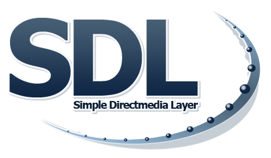

  

 
# SDL
### Simple DirectMedia Layer for Delphi

Pascal bindings that allow you to use **SDL** and other useful libraries with <a href="https://www.embarcadero.com/es/products/delphi" target="_blank">Delphi</a>. 

### Included
- SDL
- SDL_image
- SDL_mixer
- SDL_net
- SDL_ttf

### Minimum Requirements 
- Windows 10+ (64 bits)
- <a href="https://www.embarcadero.com/products/delphi/starter" target="_blank">Delphi Community Edition</a> (Win64 platform only)

### Usage
You simply add `SDL` to your uses section and everything will be linked in your executable, ready for use with no DLLs to maintain. You will have direct access to all the aforementioned libraries.

### Support
- <a href="https://github.com/tinyBigGAMES/SDL/issues" target="_blank">Issues</a>
- <a href="https://github.com/tinyBigGAMES/SDL/discussions" target="_blank">Discussions</a>
- <a href="https://tinybiggames.com/contact/" target="_blank">Contact</a>
- <a href="https://libsdl.org" target="_blank">SDL Website</a>
- <a href="https://lazyfoo.net/tutorials/SDL/index.php" target="_blank">SDL Tutorials</a> 

<h5 align="center">

Made with :heart: in Delphi
</h5>